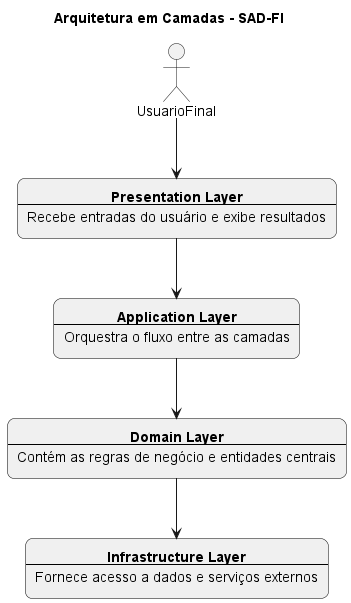
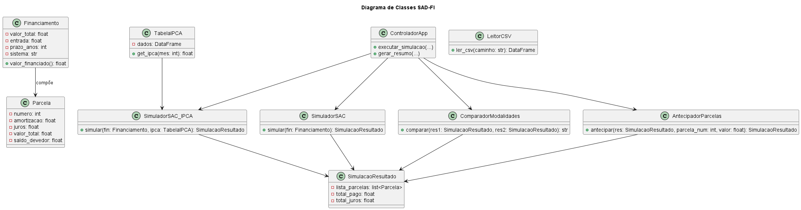

# SAD-FI – Sistema de Apoio à Decisão para Financiamento Imobiliário

Este é um projeto de MVP desenvolvido como trabalho final de pós-graduação em Ciência de Dados e Inteligência Artificial.  
O SAD-FI tem como objetivo auxiliar usuários leigos na simulação e comparação de modalidades de financiamento imobiliário.

## 🎯 Objetivos

- Simular financiamentos com os sistemas SAC e SAC+IPCA
- Comparar modalidades com base em custo total e perfil do usuário
- Visualizar a evolução das parcelas e do saldo devedor
- Avaliar o impacto da antecipação de parcelas no financiamento

## 🧰 Tecnologias e Bibliotecas Utilizadas

- Python 3.x
- Pandas
- NumPy
- Matplotlib
- Scikit-learn (eventualmente)
- Jupyter Notebooks

## 📁 Estrutura do Projeto

A estrutura completa e detalhada do projeto, com explicações de cada pasta e camada da arquitetura, está documentada no arquivo [`estrutura_projeto.md`](docs/estrutura_projeto.md).

## 🧱 Arquitetura em Camadas

O sistema segue uma arquitetura em camadas com separação entre apresentação, aplicação, domínio e infraestrutura.



> A imagem acima representa a arquitetura conceitual do sistema SAD-FI e é gerada a partir de `docs/camadas.puml` com o PlantUML.

## 🧩 Diagrama de Classes



> A imagem acima é gerada a partir do arquivo `docs/classes.puml` com o auxílio do PlantUML.

---

## 🚀 Como executar

## ▶️ Como Executar o Projeto

1. Clone este repositório:
   ```bash
   git clone https://github.com/seu-usuario/sad-fi.git
   cd sad-fi
   ```

2. Crie o ambiente virtual:

   ```bash
   python -m venv venv
   ```

3. Ative o ambiente virtual:

   * **Windows**:
     ```bash
     venv\Scripts\activate
     ```
   * **Linux/macOS**:
     ```bash
     source venv/bin/activate
     ```

4. Instale as dependências:

   ```bash
   pip install -r requirements.txt
   ```

5. Execute os notebooks disponíveis na pasta `notebooks/`.

---

## 🧪 Testes

Os testes são organizados na pasta tests/, com scripts dedicados para cada componente do sistema. O desenvolvimento segue abordagem TDD (Test-Driven Development), utilizando scripts simples com assert e print para facilitar a verificação manual. Futuramente, poderá ser adotado pytest para maior robustez e automação.

## 📄 Licença

Projeto acadêmico sem fins comerciais.

---

## 🗂️ Sprint 1 – Resumo das Issues

| #  | Título da Issue                                              | Etiqueta         | Status | Milestone |
|----|--------------------------------------------------------------|------------------|--------|-----------|
| 1  | Inicializar repositório com estrutura de pastas              | 🟩 Documentação   | ✅     | Sprint 1  |
| 2  | Configurar ambiente virtual e requirements.txt               | 🟩 Documentação   | ✅     | Sprint 1  |
| 3  | Implementar classe Financiamento                             | 🟦 Técnica        | ✅     | Sprint 1  |
| 4  | Implementar classe Parcela                                   | 🟦 Técnica        | ✅     | Sprint 1  |
| 5  | Implementar classe SimuladorSAC                              | 🟦 Técnica        | ✅     | Sprint 1  |
| 6  | Escrever testes para Financiamento, Parcela e SimuladorSAC  | 🟪 Testes         | ✅     | Sprint 1  |
| 7  | Gerar notebook de visualização da simulação SAC             | 🟨 Visualização   | ✅     | Sprint 1  |
| 8  | Refinar visualizações com foco em clareza e escala          | 🟨 Visualização   | ✅     | Sprint 1  |
| 9  | Versionar scripts, notebooks e arquivos auxiliares           | 🟩 Documentação   | ✅     | Sprint 1  |
| 10 | Criar planejamento e backlog de funcionalidades futuras      | 🟩 Documentação   | 🔲     | Sprint 1  |

## 📚 Histórico de Comandos Git

A lista de comandos Git utilizados durante a Sprint 1 está disponível [neste arquivo separado](docs/comandos_git.md).


