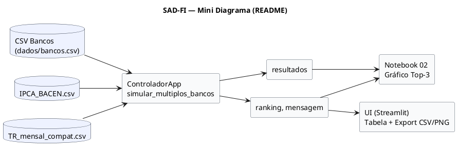

# SAD-FI — Pacote de Transição (Sprint 3 → conclusão & UI)

## 1. Visão geral (estado atual)

- Modalidades: SAC, SAC_TR, SAC_IPCA funcionando no ControladorApp.
- Dados (offline-first):
    - dados/bancos.csv gerado a partir dos CSVs do site do BCB (ReportTxJuros).
    - dados/txjuros/IPCA_BACEN.csv (mensal, em %) e dados/txjuros/TR_BACEN.csv (diário, em %).
    - TR_mensal_compat.csv gerado no notebook (colunas data,tr, fração), consumido pelo controlador.
- Notebook 02 refatorado: monta bancos.csv, processa TR/IPCA (CSV), executa simulação multi-bancos, ranking e gráfico Top-3.
- Correções cruciais: unidade da TR (%→fração), padding de IPCA para prazos longos, deduplicação e limpeza de bancos.csv, logs melhores.

# 2. Mapa do repositório 

``` 
SAD-FI
├── .git
│   ├── COMMIT_EDITMSG
│   ├── FETCH_HEAD
│   ├── HEAD
│   ├── ORIG_HEAD
│   ├── config
│   ├── description
│   ├── hooks
│   │   ├── applypatch-msg.sample
│   │   ├── commit-msg.sample
│   │   ├── fsmonitor-watchman.sample
│   │   ├── post-update.sample
│   │   ├── pre-applypatch.sample
│   │   ├── pre-commit.sample
│   │   ├── pre-merge-commit.sample
│   │   ├── pre-push.sample
│   │   ├── pre-rebase.sample
│   │   ├── pre-receive.sample
│   │   ├── prepare-commit-msg.sample
│   │   ├── push-to-checkout.sample
│   │   ├── sendemail-validate.sample
│   │   └── update.sample
│   ├── index
│   ├── info
│   │   ├── exclude
│   │   └── refs
│   └── refs
│       ├── heads
│       │   └── main
│       ├── remotes
│       │   └── origin
│       │       ├── HEAD
│       │       ├── feat
│       │       │   └── coletor-ipca
│       │       └── main
│       └── tags
│           └── sprint1-final
├── .gitignore
├── README.md
├── TRANSITION_PACKAGE_SPRINT3.md
├── cronograma_sprint1.md
├── dados
│   ├── bancos.csv
│   ├── ipca.csv
│   ├── ipca_360.csv
│   ├── ipca_fixo.csv
│   ├── ipca_tratado.csv
│   └── txjuros
│       ├── 2025-07P_pos_IPCA_903203.csv
│       ├── 2025-07P_pos_TR_903201.csv
│       ├── 2025-07P_pre_903101.csv
│       ├── IPCA_BACEN.csv
│       ├── TR_BACEN.csv
│       └── TR_mensal_compat.csv
├── docs
│   ├── ADR-001-interface-minima.md
│   ├── UX-mensagens.md
│   ├── camadas.puml
│   ├── classes.puml
│   ├── comandos_git.md
│   ├── contexto_sprint3.puml
│   ├── contratos-io.md
│   ├── esboco_interface_sprint3.md
│   ├── estados.puml
│   ├── estrutura_projeto.md
│   ├── out
│   │   └── docs
│   │       ├── camadas
│   │       │   ├── SADFI_Camadas_Sprint2_Simples_Clean.png
│   │       │   ├── camadas_Sprint1.png
│   │       │   └── camadas_Sprint2.png
│   │       ├── classes
│   │       │   ├── classes_Sprint1.png
│   │       │   ├── classes_Sprint2.png
│   │       │   └── classes_Sprint2_rev_parcela.png
│   │       ├── contexto_sprint3
│   │       │   └── Contexto_SAD-FI_Sprint3.png
│   │       ├── estados
│   │       │   ├── SADFI_Estados_Sprint2_Linear.png
│   │       │   ├── estados_Sprint1.png
│   │       │   └── estados_Sprint2.png
│   │       ├── sequencia
│   │       │   ├── SADFI_Sequencia_Sprint2_Rev_Fix.png
│   │       │   ├── sequencia_Sprint1.png
│   │       │   └── sequencia_Sprint2.png
│   │       └── wireframes
│   │           ├── ui_flow
│   │           │   └── FluxoInterfaceSADFIsprint3.png
│   │           └── ui_screens
│   │               └── ui_components.png
│   ├── runbook_e2e.md
│   ├── sequencia.puml
│   └── wireframes
│       ├── tela1.txt
│       ├── tela2.txt
│       ├── ui_flow.puml
│       └── ui_screens.puml
├── estrutura.txt
├── gerar_estrutura.py
├── issues_por_nome-sprint2.txt
├── issues_por_nome-sprint3.txt
├── issues_por_nome.txt
├── notebooks
│   ├── 01_visualizacao_simulacao.ipynb # Testa as simulações, com base nelas.
│   ├── 02_visualizacao_simulacao_controlador.ipynb  # Principal. APIs do BACEN não funcionaram, então estamos usando arquivos CSV baixados do BACEN
│   ├── 03_visualizacao_simulacao_offline.ipynb # não implementado
│   ├── dados
│   │   └── bancos.csv
│   └── resultados
│       ├── ranking.csv
│       └── ranking.png
├── out
│   └── docs
├── requirements.txt
├── resultados
│   ├── graficos
│   │   ├── parcelas.png
│   │   └── ranking.png
│   ├── ranking.csv
│   ├── simulacao_teste_2025-08-10_1553.csv
│   ├── simulacao_teste_2025-08-10_1600.csv
│   ├── simulacao_teste_2025-08-10_1603.csv
│   ├── simulacao_teste_2025-08-15_1437.csv
│   ├── simulacao_teste_2025-08-15_1438.csv
│   ├── simulacao_teste_2025-08-15_1439.csv
│   └── simulacao_teste_2025-08-17_0225.csv
├── salvar_issues.ps1
├── src
│   ├── application
│   │   ├── comparador.py   # Comparador de múltiplos resultados de simulação.
│   │   └── controlador.py   # ControladorApp.simular_multiplos_bancos(...)
│   ├── domain
│   │   ├── antecipador.py   # Ainda não implementada
│   │   ├── comparador.py   # Classe responsável por comparar duas modalidades de financiamento
│   │   ├── financiamento.py   # Representa um contrato de financiamento
│   │   ├── parcela.py   # Representa uma única parcela de um financiamento.
│   │   ├── recomendador.py   # Classe responsável por gerar uma recomendação textual com base nos resultados 
│   │   ├── simulacao_resultado.py   # Resultado com .parcelas, total_pago, (to_dataframe)
│   │   ├── simulador_sac.py   # Simulador SAC (suporta TR)
│   │   └── simulador_sac_ipca.py   # Simulador SAC+IPCA
│   ├── infrastructure
│   │   └── data
│   │       ├── carregador_IPCA_CSV.py   # carregar_ipca_bacen_csv(path) → df (data, ipca fração)
│   │       ├── carregador_tr_mensal_CSV.py    # carregar_tr_mensal(path_diario, ...) → df (data, tr fração)
│   │       ├── coletor_bacen.py
│   │       ├── coletor_tr.py    # online/normalização (não requeridos para offline)
│   │       ├── coletor_txjuros.py
│   │       ├── exportador_csv.py
│   │       ├── gerador_bancos.py   # gera dados/bancos.csv (a partir dos CSVs do site)
│   │       ├── leitor_bancos.py   # valida/normaliza bancos.csv
│   │       ├── leitor_csv.py
│   │       ├── salvar_ipca_tratado.py
│   │       ├── tabela_ipca.py
│   │       ├── tabela_ipca_plus.py
│   │       └── tabela_tr.py    # online/normalização (não requeridos para offline)
│   └── presentation    # ainda vazio
├── tests
│   ├── [APOSENTADO]test_sac_tr_opcional.py
│   ├── [APOSENTADO]test_simulador_sac.py
│   ├── [APOSENTADO]test_simulador_sac_ipca.py
│   ├── acceptance_scenarios.md
│   ├── fixtures
│   │   └── tr_fixture.csv
│   ├── integracao_tr_controlador.py
│   ├── smoke_leitor_bancos.py
│   ├── test_coletor_bacen.py
│   ├── test_coletor_bacen_online.py
│   ├── test_comparador_modalidades.py
│   ├── test_comparador_varios.py
│   ├── test_controlador_comparacao.py
│   ├── test_controlador_exportacao.py
│   ├── test_controlador_ipca_missing.py
│   ├── test_controlador_multibancos.py
│   ├── test_controlador_recomendacao.py
│   ├── test_controlador_simulacao.py
│   ├── test_financiamento.py
│   ├── test_leitor_bancos.py
│   ├── test_leitor_csv.py
│   ├── test_parcela.py
│   ├── test_recomendacao_automatica.py
│   ├── test_recomendador.py
│   ├── test_sac_ipca_regra_revisada.py
│   ├── test_sac_tr_transparencia.py
│   ├── test_simulador_sac_encapsulado.py
│   ├── test_simulador_sac_ipca_encapsulado.py
│   ├── test_simulador_sac_ipca_vs_fixo.py
│   ├── test_tabela_ipca.py
│   ├── test_tabela_ipca_from_dataframe.py
│   └── test_tabela_tr.py
├── tools
│   └── gerar_ipca_longo.py
├── trecho_README.md
```

# 3. Contratos essenciais

## 3.1. Controlador

```python
resultados, ranking, mensagem = ControladorApp().simular_multiplos_bancos(
    caminho_bancos_csv: str,                  # dados/bancos.csv (utf-8)
    dados_financiamento: dict,                # {valor_total, entrada, prazo_anos, taxa_juros_anual}
    fonte_ipca: dict | None = {"caminho_ipca": "dados/txjuros/IPCA_BACEN.csv"},
    fonte_tr:   dict | None = {"fixture_csv_path": "dados/txjuros/TR_mensal_compat.csv"},
)
# resultados: dict[str, SimulacaoResultado]
# ranking:    list[(rotulo, total_pago)]
# mensagem:   str (texto recomendação)
```

## 3.2. bancos.csv (entrada do controlador)
- Colunas: nome, sistema ∈ {SAC, SAC_TR, SAC_IPCA}, taxa_anual em fração (0<x<1).
- Um banco pode aparecer em múltiplas linhas (uma por sistema).

## 3.2. Série TR/IPCA (offline)
- TR: TR_mensal_compat.csv com data (YYYY-MM), tr em fração (ex.: 0.0017 = 0,17% a.m.).
- IPCA: IPCA_BACEN.csv bruto; o pipeline atual consegue consumir via TabelaIPCA (normaliza %).

# 4. Itens faltantes (prioridades para próxima fase)

## 4.1. MUST
- UI mínima (aplicação de apresentação)
    - Seleção de dados_financiamento.
    - Seleção de bancos.csv (gerar/atualizar a partir dos CSVs do site).
    - Seleção das fontes (IPCA_BACEN.csv, TR_mensal_compat.csv).
    - Executar simulação + exibir ranking, recomendação e gráfico Top-3.
    - Exportar resultados/ranking.csv e resultados/graficos/ranking.png.
- Testes E2E offline automatizados (rodar Controlador com CSVs reais do BCB e validar outputs básicos).

## 4.2. SHOULD
- Refino de mensagens/logs (UX de terminal): apontar arquivos usados e avisar quando cair em fallback.
- README + Runbook (offline) com passos claros para reproduzir o cenário.

## 4.3. COULD
- Cache leve de séries e parsing para acelerar runs repetidos.
- Opção de aceitar DataFrame diretamente no Controlador (fonte_ipca={"dataframe": df}, fonte_tr={"dataframe": df}).

# 5. Plano técnico para UI (recomendado: Streamlit)

Motivo: time-to-value curto, sem boilerplate; combina bem com notebooks já existentes.

## 5.1. Estrutura proposta

```
src/presentation/
├─ ui_app.py           # Streamlit: telas, interações, gráficos
├─ ui_state.py         # dataclasses de estado/inputs
└─ formatters.py       # utilitários de formatação (moeda, datas)
```

## 5.2. Esqueleto sugerido (copiar/colar)

### 5.2.1. src/presentation/ui_state.py

```python
from dataclasses import dataclass

@dataclass
class FinanciamentoInput:
    valor_total: float = 300_000.0
    entrada: float = 60_000.0
    prazo_anos: int = 30
    taxa_juros_anual: float = 0.11  # fração

@dataclass
class FontesInput:
    caminho_bancos: str = "dados/bancos.csv"
    caminho_ipca: str = "dados/txjuros/IPCA_BACEN.csv"
    caminho_tr_compat: str = "dados/txjuros/TR_mensal_compat.csv"
```

### 5.2.2. src/presentation/formatters.py

```python
def brl(valor: float) -> str:
    return "R$ " + f"{valor:,.2f}".replace(",", "X").replace(".", ",").replace("X", ".")
```

### 5.2.3. src/presentation/ui_app.py

```python
import streamlit as st
from pathlib import Path
import pandas as pd
from application.controlador import ControladorApp
from presentation.ui_state import FinanciamentoInput, FontesInput
from presentation.formatters import brl
import matplotlib.pyplot as plt

st.set_page_config(page_title="SAD-FI — Comparador", layout="wide")
st.title("SAD-FI — Comparador de Financiamentos (SAC, SAC TR, SAC IPCA)")

# Inputs
col1, col2 = st.columns(2)
with col1:
    fin = FinanciamentoInput(
        valor_total=st.number_input("Valor do imóvel", 0.0, 10_000_000.0, 300_000.0, step=1_000.0),
        entrada=st.number_input("Entrada", 0.0, 9_999_999.0, 60_000.0, step=1_000.0),
        prazo_anos=st.number_input("Prazo (anos)", 1, 40, 30, step=1),
        taxa_juros_anual=st.number_input("Taxa base a.a. (fração)", 0.0, 1.0, 0.11, step=0.005),
    )
with col2:
    fontes = FontesInput(
        caminho_bancos=st.text_input("bancos.csv", "dados/bancos.csv"),
        caminho_ipca=st.text_input("IPCA (CSV Bacen)", "dados/txjuros/IPCA_BACEN.csv"),
        caminho_tr_compat=st.text_input("TR (mensal compat.)", "dados/txjuros/TR_mensal_compat.csv"),
    )

run = st.button("Executar comparação")

if run:
    ctrl = ControladorApp()
    fonte_ipca = {"caminho_ipca": fontes.caminho_ipca}
    fonte_tr   = {"fixture_csv_path": fontes.caminho_tr_compat}
    resultados, ranking, msg = ctrl.simular_multiplos_bancos(
        caminho_bancos_csv=fontes.caminho_bancos,
        dados_financiamento={
            "valor_total": fin.valor_total,
            "entrada": fin.entrada,
            "prazo_anos": fin.prazo_anos,
            "taxa_juros_anual": fin.taxa_juros_anual,
        },
        fonte_ipca=fonte_ipca,
        fonte_tr=fonte_tr,
    )

    st.subheader("Ranking")
    df_rank = pd.DataFrame(ranking, columns=["Oferta", "Total Pago"])
    st.dataframe(df_rank.style.format({"Total Pago": brl}), use_container_width=True)

    st.info(msg)

    # Gráfico Top-3 (eixo anual)
    def _serie_parcelas(res):
        if hasattr(res, "to_dataframe"):
            try:
                df = res.to_dataframe()
                if {"n_parcela","valor_parcela"}.issubset(df.columns):
                    return df["n_parcela"].tolist(), df["valor_parcela"].tolist()
            except Exception:
                pass
        px = [getattr(p, "numero", i+1) for i,p in enumerate(res.parcelas)]
        py = [float(p.valor_total) for p in res.parcelas]
        return px, py

    st.subheader("Evolução do valor da parcela — Top 3")
    top3 = ranking[:3]
    fig = plt.figure(figsize=(10, 5))
    for rotulo, _ in top3:
        x, y = _serie_parcelas(resultados[rotulo])
        plt.plot(x, y, linewidth=2, label=rotulo)
    # ticks anuais
    if top3:
        n = max(len(_serie_parcelas(resultados[r])[0]) for r,_ in top3)
        anos = list(range(12, n+1, 12))
        if anos:
            plt.xticks(anos)
    plt.xlabel("Parcela (marcas anuais)")
    plt.ylabel("Valor (R$)")
    plt.title("Top 3 — Evolução das parcelas")
    plt.grid(True, alpha=0.25)
    plt.legend()
    st.pyplot(fig)

    # Export rápidos
    out_dir = Path("resultados"); out_dir.mkdir(exist_ok=True)
    df_rank.to_csv(out_dir/"ranking.csv", index=False, encoding="utf-8")
    st.caption(f"CSV salvo em: {out_dir/'ranking.csv'}")
```

## 5.3. Como rodar a UI

```bash
# raiz do projeto
pip install streamlit matplotlib pandas
streamlit run src/presentation/ui_app.py
```
Obs.: mantendo offline-first — a UI usa os mesmos CSVs locais do notebook.

# 6. Testes (plano mínimo para próxima fase)
- Smoke UI: abrir app, preencher inputs padrão, executar, checar:
    - DataFrame de ranking com ≥1 linha.
    - Mensagem de recomendação não-vazia.
    - Gráfico renderizado sem exceções.
- E2E offline (headless):
    - Script Python que chama o Controlador com os arquivos CSV da pasta dados/txjuros/ e confere:
        - len(ranking) > 0
        - min(total_pago) > 0
        - presença das três modalidades quando existirem no bancos.csv.


# 7. Riscos / cuidados
- Unidade TR: sempre garantir fração ao salvar TR_mensal_compat.csv.
- IPCA: se prazo for maior que a série, padding é aplicado (último valor).
- bancos.csv: garantir TaxaJurosAoAno → fração; não usar coluna mensal sem converter; remover linhas “Fonte”.

# 8. Checklist para o(a) próximo(a) auxiliar

[ ] Confirmar ambiente: Python 3.10+, pip install -r requirements.txt (ou instalar libs citadas acima).
[ ] Verificar presença dos CSVs em dados/txjuros/.
[ ] Rodar Notebook 02 até a célula de export.
[ ] Testar UI (Streamlit).
[ ] Produzir evidências (capturas do ranking e do gráfico).
[ ] Atualizar README com seção “UI (offline)”.
[ ] Marcar cartões concluídos e abrir PR único (squash).

# 9. Anexo — Mini-diagrama (Mermaid) para README


